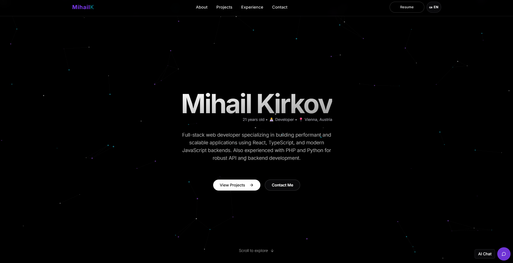

# Mihail's Portfolio Website

A personal developer portfolio built with **Next.js** and **TypeScript**, styled with **Tailwind CSS** and **shadcn/ui**.  
It showcases my projects, skills, and experience — with an **AI-powered chat assistant** that can answer questions about me and my work.



---

## ✨ Features

- **Modern stack**  
  - Next.js 13+ (App Router)  
  - TypeScript  
  - Tailwind CSS + shadcn/ui  
  - Framer Motion animations

- **Dynamic content**  
  - Projects, skills, and experience managed in **Firebase Firestore**  
  - Admin dashboard for CRUD operations

- **AI Chat Widget**  
  - Floating bottom-right assistant (`MIH🟦AI🟦L Chat Bot`)  
  - Supports suggested prompts, streaming responses, and “thinking” animation  
  - Uses OpenAI GPT + embeddings with retrieval (RAG) from portfolio data

- **Responsive design**  
  - Works smoothly on desktop and mobile  
  - Accessible with ARIA labels and keyboard support

---

## 📂 Project Structure

```bash
.
├── app/                # Next.js app router pages
├── components/         # Reusable UI and chat components
│   └── chat/           # Chat widget pieces (input, list, suggestions, etc.)
├── hooks/              # Custom React hooks (e.g., useChatStream)
├── lib/                # OpenAI, Firebase, RAG utilities
├── public/             # Static assets (e.g., avatar images)
├── scripts/            # Ingestion scripts for embeddings
└── types/              # Shared TypeScript types
