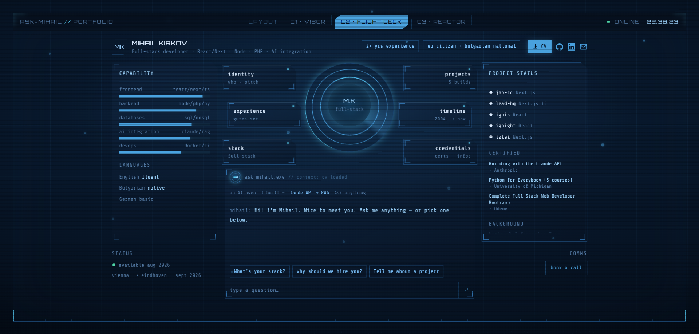
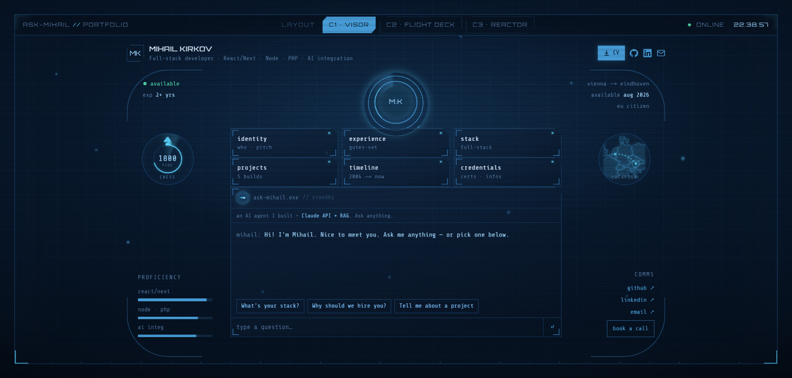
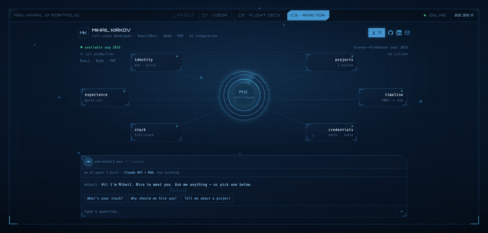
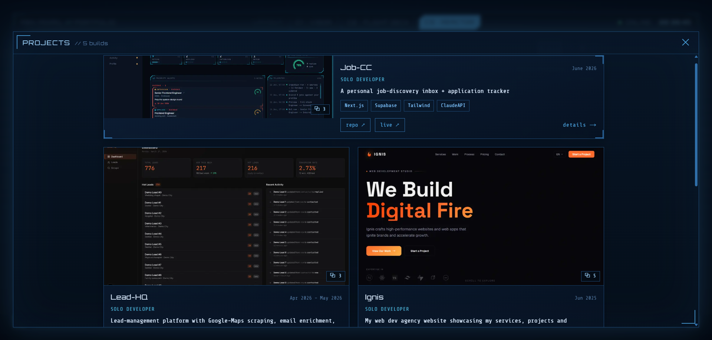

# Mihail Kirkov — Portfolio

> An interactive, cockpit-style portfolio for a full-stack developer. Three switchable HUD layouts, a central reactor core that tilts to your cursor, and an **AI agent I built** that answers questions about me in real time.

**🔗 Live:** https://portfolio-mihail.vercel.app/

[](https://portfolio-mihail.vercel.app/)


---

## What this is

I'm **Mihail Kirkov** — a full-stack developer (React/Next · Node · PHP) with hands-on AI-integration experience and 2+ years in production. EU citizen, relocating to **Eindhoven, NL in September 2026** and **available from August**.

This site is my portfolio, built to do more than list a CV: it's a single-screen "spaceship cockpit" interface where each section opens as a hologram, and a built-in AI agent (grounded on my CV) lets a recruiter just *ask* — "what's your stack?", "why hire you?", "tell me about a project" — and get an instant answer. It's also, deliberately, a working demonstration of the frontend + AI-integration skills it describes.

> If you're a recruiter: the **live site** is the fastest way to get the full picture — it's interactive. This README covers what's under the hood.

## Screenshots

<!-- Add the PNGs to docs/screenshots/ in the repo (filenames below). The three
     mode shots already exist from local runs; drop them in and they'll render. -->

**Flight Deck** — the default layout: capability gauges, live project status, the core, and the AI terminal.



**Visor** — a helmet-view layout with flanking instrument dials (chess + a Vienna→Eindhoven locator).



**Reactor** — a radial layout with the section nodes orbiting a central arc-reactor core.



**Project deck** — projects open into a full-screen holographic gallery with per-project detail.



## Highlights

- **Three HUD modes that *morph* between each other.** The core, section nodes, and terminal are rendered once and physically glide/resize into the new arrangement (Framer Motion layout animations) — not a crossfade.
- **An AI chat terminal I built end-to-end.** RAG-lite: grounded on my profile, served from a serverless route with the API key kept server-side, output/token caps, and per-IP rate limiting. The three suggested questions return instantly with zero network so the headline answers always work.
- **3D reactor core** that tilts toward the cursor with parallaxed rings (CSS 3D transforms, no heavy 3D engine).
- **Holographic section modals**, a career **timeline**, a skills **radar chart**, and a real **Vienna→Eindhoven map** for the relocation story.
- **Accessible and motion-aware** — keyboard-navigable, focus-trapped modals, ARIA roles, and a full `prefers-reduced-motion` fallback.
- **Mobile** collapses the cockpit to a clean, fully functional vertical stack.

## Tech stack

- **Framework:** Next.js 15 (App Router) + TypeScript
- **Styling:** Tailwind CSS + hand-built HUD components (SVG / CSS, `clip-path`, backdrop-blur)
- **Animation:** Framer Motion (mode morph), CSS keyframes
- **AI:** Claude API (Haiku) via a serverless route
- **Maps:** react-simple-maps with locally bundled topojson (no runtime map API)
- **Hosting:** Vercel (static SSG + serverless function for chat)

## Architecture notes

A couple of decisions worth calling out, since they show how I think about reliability:

- **The public site never calls a database at runtime.** All content is read from a committed `content/seed.json` and baked into static HTML at build time — so pages load instantly with no spinner and the site keeps working regardless of any backend state. Content is one file to edit.
- **The AI agent fails gracefully.** The key never reaches the browser; requests are token- and rate-limited; and the three suggestion chips are answered client-side, so the feature still demos perfectly even with no API key or during an outage.

## Run it locally

```bash
git clone <this-repo>
cd portfolio-mihail
npm install
npm run dev
# open http://localhost:3000
```

**Environment variables** (`.env.local`):

```bash
ANTHROPIC_API_KEY=        # server-only — enables the live "ask anything" chat
NEXT_PUBLIC_SITE_URL=     # e.g. https://portfolio-mihail.vercel.app (for OG/canonical)
```

The site builds and runs without these — the canned suggestion answers work offline, and `NEXT_PUBLIC_SITE_URL` only affects metadata. `ANTHROPIC_API_KEY` is only needed for free-typed chat questions.

Editing content: everything (profile, experience, projects, certs, timeline, skills) lives in `content/seed.json`.

## Contact

- **Email:** mihailkirkov04@gmail.com
- **LinkedIn:** https://www.linkedin.com/in/mihail-kirkov-b65b36262/
- **GitHub:** https://github.com/MihailKirkov
- **Portfolio:** https://portfolio-mihail.vercel.app/

EU citizen — no visa, work permit, or sponsorship required. Open to on-site/hybrid roles in Eindhoven and remote-EU.

---

<sub>Built with Next.js, TypeScript, and Claude. Design and code by Mihail Kirkov.</sub>